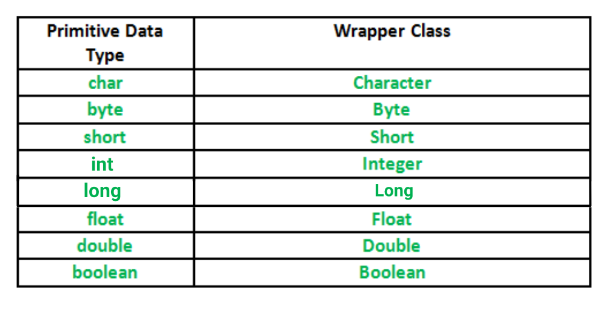

#Java for interview

## Data types

Java is ***statically typed and also a strongly typed language*** because, in Java, each type of data (such as integer, character, hexadecimal, packed decimal, and so forth) is predefined as part of the programming language and all constants or variables defined for a given program must be described with one of data types. 


- **Primitive Data types:** such as boolean, char, int, short, byte, long, float, and double.
- **Non-Primitive Data Type or Object Data type:** such as String, Array, etc.


### * Primitive Data types


### * Non-Primitive Data Type or Reference Data Types

The **Reference Data Types** will contain a memory address of variable value because the reference types won't store the variable value directly in memory. They are `string, object, arrays, etc`.

`String` - are defined as an array of characters. The difference between a caracter array and string in Java is, the string is designed to hold a sequence of characters in a single variable whereas, a character array is a collection of separate char type entities.

`Class` - is a user-defined blueprint of prototype from which object are created. It reprezents the set of proprties or methods that are common to all objects of one type.

`Object` - It is a basic unit of OOP and reprezents the real-life entities. A typicali Java program creates many objects, which as you know, interact by invoking methods.

`Interface` - Like a class, an interface can have methods and variables, but the methods declared in an interface are by default abstract (only method signature, nobody).  _Interfaces specify what a class must do and not how. It is the blueprint of the class._

`Array` - is a group of like-typed variables that are referred to by a common name.


###Good to know
`char` - Java use the Unicode system not ASCII code system and to reprezent Unicode system 8 bit is not enough to reprezent all characters so java uses 2 bytes for characters.

`float and double` - were designed especially for scientific calculations, where approximation errors are acceptable. If accuracy is the most prior concern then, it is recommended not to use these data types and use **BigDecimal** class instead.

`String` - in Java are not terminate with a null character.

`Class` - A class can only extend (subclass) one parent and  			implement more than one interface.

`Array` - The direct superclass of an array type is Object, and every array type implements the interface **_Clonable_** and **_java.io.Serializable_**.


## Wrapper Classes in Java


A **wrapper class** is a class which contains the **primitive data types** (int, char, byte, etc). In other words, wrapper classes provide a way to use **primitive data types** as object.



### Why we need Wrapper Class
> - Wrapper Class will **convert primitive data types into objects.** The object are necessary if we wish to modify the arguments passed into the method (because primitive types are **passed by value**).
> - **Data structures** in Collection framework such as **ArrayList and Vector** store only the objects(reference types) and not the **primitive types**.
> - The object is needed to support **synchronization in multithreading**.


### Autoboxing and Unboxing

- **Autoboxing** - conversion of int to Integer, long to Long, double to Double, etc. 

```java
import java.util.ArrayList; 
class Autoboxing 
{ 
    public static void main(String[] args) 
    { 
        char ch = 'a'; 
  
        // Autoboxing- primitive to Character object conversion 
        Character a = ch; 
  
        ArrayList<Integer> arrayList = new ArrayList<Integer>(); 
  
        // Autoboxing because ArrayList stores only objects 
        arrayList.add(25); 
  
        // printing the values from object 
        System.out.println(arrayList.get(0)); 
    } 
} 
```
		
- **Unboxing** - conversion of Integer to int, Long to long, Double to double, etc.

```java
import java.util.ArrayList; 
  
class Unboxing 
{ 
    public static void main(String[] args) 
    { 
        Character ch = 'a'; 
  
        // unboxing - Character object to primitive conversion 
        char a = ch; 
  
        ArrayList<Integer> arrayList = new ArrayList<Integer>(); 
        arrayList.add(24); 
  
        // unboxing because get method returns an Integer object 
        int num = arrayList.get(0); 
  
        // printing the values from primitive data types 
        System.out.println(num); 
    } 
} 
```
		
###Good to know
== works for Integer value in interval -128 to 127, Values between -128 and 127 are cached for reuse to optimise Autoboxing.

- You can set upper bound greater than 127 using -XX:AutoBoxCacheMax=NEWVALUE

```java	
public static void main(String[] args) {
	
 		Integer k = new Integer(10);
      	Integer k1 = new Integer(10);
      	
      	Integer k2 = 127;
      	Integer k3 = 127;
      	
      	Integer k4 = 129;
      	Integet k5 = 129;
      	
      	System.out.println(k == k1);
      	System.out.println(k2 == k3);
      	System.out.println(k4 == k5);
}
```
`output:`

- false
- true
- false

# Casting
-

### Type Casting (Primitives)
Type casting is when you assing a value of one primitive data type to another type.

In Java, there are two types of casting:

**Widening Casting (automatically)** `Lărgirea` - converting a _***smaller***_ type to a **_*larger*_** type size

`byte -> short -> char -> int -> long -> float -> double`

```java
public class Main {
  public static void main(String[] args) {
    char myChar = 'A';
    int myInt = myChar; // Automatic casting: char to int
	
    System.out.println(myChar);      // Outputs A
    System.out.println(myInt);   // Outputs 65
  }
}
```


**Narrowing Casting (manually)** `Restrânge` - converting a **_*larger*_** type to a _***smaller***_ size type.

`double -> float -> long -> int -> char -> short -> byte`

```java
public class Main {
  public static void main(String[] args) {
    double myDouble = 9.78;
    int myInt = (int) myDouble; // Manual casting: double to int
	
    System.out.println(myDouble);   // Outputs 9.78
    System.out.println(myInt);      // Outputs 9
  }
}
```
### Type Casting (Object, Reference)
1. **Upcasting (automatically)** -> Casting from a ***subclass*** to a _***superclass***_. 
	- A reference variable can refer to an object if the object is of the same type as a variable or if it is a subtype
	- Upcasting happens implicitly.

2. **Downcasting (manually)** -> Casting from a _***superclass***_ to a _***subclass***_.
	- Downcasting is necessary to gain access to members specific to subclass.
	- Downcasting is done using cast operator.
	- To downcast an object safely, we need instanceof operator.
	- If the real object doesn't match the type we downcast to, then ClassCastException will be thrown at runtime.

	
### Good to know


## OOP Concepts


### `Polymorphism` 
Ability of OOPs languages to differentiate between entities with the same name efficiently.
	
* Polymorphism in Java are mainly of 2 types:
	* Overloading (supraincarcare) ***Compile-time, static polymorphism***
	* Overriding (suprascriere) ***Run-time, dynamic polymorphism***

`Overloading` - We can change only number of args and types of args.
We can change and return type only if return type isn't the only one difference between methods.

`Overriding` -   It is the type of the object being referred to (not the type of the reference variable) that determines which version of an overridden method will be executed.
		
* The _***access modifier***_ for an overriding method can allow more, but not less, access than the overridden method.
* _***Final methods***_ can not be overridden.
* _***Static methods***_ can not be overridden.( When you define a static method with same signature as a static method in base class, it is known as ***method hiding***)

* _***Private methods***_ can not be overridden .
* _***Overriding and constructor***_, we can not override constructor as parent and child class can never have constructor with same name.
* We can have _***multilevel method-overriding***_


### `Inheritance`(Mostenire)
It is the mechanism in java by which one class is allow to inherit the features(fields and methods) of another class.

**Type of Inheritance** 

1. `Single Inheritance` -> one superclass and one subclass.
	
	

2. ` Multilevel Inheritance` -> adsasd.

	 
	
3. `Hierarchical Inheritance` -> one superclass and > 1 subclass.

4. `Multiple Inheritance(Through Interfaces)` -> we can achieve multiple inheritances only through Interfaces.
	
	
	
5. `Hybrid Inheritance(Through Interfaces)` -> It is a mix of two or more of the above types of inheritance.

	
	
### Good to know.

* `Default superclass` - Except Object class, which has no superclass, **every class has one and only one direct superclass** (single inheritance). In the absence of any other explicit superclass, _***every class is implicitly a subclass of Object class***_.
* `Superclass can only be one` - A superclass can have any number of subclasses. But a subclass can have only one superclass.
* `Inheriting Constructors` - A subclass inherits all the members from its superclass. Constructors are not members.
* `Private member inheritance` - A subclass does not inherit the private members of its parent class, you need ***_getters and setters_***
* ***`Java IS-A type of Relationship`***

### `Encapsulation`
It is mechanism that binds together code and the data it manipulates. Another way to think about encapculation is, it is a ***_protective shield that prevents the data from being accessed by the code outside this shield._***

**Encapsulation** can be achieved by Declaring all the variables in the class as private and writing public methods in the class to set and get the values of variables (getter and setter).

* combination of data-hiding and abstraction

###Good to know
####`Advantages of Encapsulation:`
* `Data Hiding` -> The user will have no idea about the inner implementation of the class. Only getter and setter is accesible for.
* `Increased Flexibility` -> We can make the variables of the class as read-only or write-know. We have to omit the ***_setter_*** or ***_getter_***.
* `Reusability`.
* `Testing code is easy` -> Encapsulated code is easy to test for unit testing.

### `Abstractization`
***_Data Abstraction_*** only the essential details are displayed to the user.

***Consider a real-life example of a man driving a car***. The man only knows that pressing the accelerators will increase the speed of car or applying brakes will stop the cat, but he does not know about how it works.

In java, abstraction is achieved by ***interfaces***, and ***abstact classes***. We can achieve **100% abstraction using interface**

###Good to know
* There ***can be no object of an abstract class***. That is, an abstract class can not be directly instantiated with the new operator.
* ***Encapsulation is data hiding***(information hiding) while **Abstraction is detail hiding**(implementation hiding).
* ***Advantages of Abstraction***.
	
	* It reduces the complexity of viewing the things.
	* Avoids code duplication and increases reusability.
	* Helps to increase security of an application or program as only important details are provided to the user.

### `Class`
A class is a user defined blueprint or prototype from which objects are created. It represents the set of properties or methods that are common to all objects of one type.
### `Object`
It is a basic unit of Object-Oriented Programming and represents the real life entities. A typical Java program creates many objects, which as you know, interact by invoking methods.

## `Exceptions`
##### Error vs Exception:
* `Error` -> An Error indicates serious problem that a reasonable application should not try to catch.
* `Exception` -> Exception indicates conditions that a reasonable application might try to catch.


#### Exception can be checked and unchecked.
* `Checked` -> are checked at compile time. 
* `Unchecked` -> are not checked at compile time.
In Java exceptions under Error and RuntimeException classes ***_are unchecked_*** exceptions, everything else under throwable ***_is checked_***.
			
		ArithmeticException is an unchecked exception.
		
* If a client can reasonably be expected to recover from an exception, ***_make it a checked exception_***. If a client cannot do anything to recover from the exception, ***_make it an unchecked exception_***.

* ***throw*** -> The flow of execution of the program stops immediately after the throw statement is executed and the nearest enclosing try block is checked to see if it has a catch statement that matches the type of exception. If it finds a match, controlled is transferred to that statement otherwise next enclosing try block is checked and so on. If no matching catch is found then the default exception handler will halt the program. 

```java
// Java program that demonstrates the use of throw
class ThrowExcep
{
    static void fun()
    {
        try
        {
            throw new NullPointerException("demo");
        }
        catch(NullPointerException e)
        {
            System.out.println("Caught inside fun().");
            throw e; // rethrowing the exception
        }
    }
 
    public static void main(String args[])
    {
        try
        {
            fun();
        }
        catch(NullPointerException e)
        {
            System.out.println("Caught in main.");
        }
    }
}
```
		
Output: 

	Caught inside fun().
	Caught in main.
* ***throws*** -> is a keyword in Java which is used in the signature of method to indicate that this method might throw one of the listed type exceptions.The caller to these methods has to handle the exception using a try-catch block.

```java
// Java program to demonstrate working of throws
class ThrowsExecp
{
    static void fun() throws IllegalAccessException
    {
        System.out.println("Inside fun(). ");
        throw new IllegalAccessException("demo");
    }
    public static void main(String args[])
    {
        try
        {
            fun();
        }
        catch(IllegalAccessException e)
        {
            System.out.println("caught in main.");
        }
    }
}
```

Output: 

	Inside fun().
	caught in main.
### Good to know

`try, catch, finally` ->we can have multiple catch and only one finaly.

* _***finally will always be executed***_.
The finally block in java is used to put important codes such as clean up code e.g. closing the file or closing the connection.
* **sub classes** of Exception must come first and **super classes** later. If you keep super classes first and sub classes later, compiler will show ***_unreachable_*** catch block error.
* The ***_throw_*** keyword is mainly used to throw custom exceptions
* _***throws***_ keyword is required only for checked exception and usage of throws keyword for unchecked exception is meaningless
* _***throws***_ keyword is required only to convince compiler and usage of throws keyword does not prevent abnormal termination of program.

## Collections
Any group of individual object which are reprezented as a single unit is known as the collection of the objects. 
The ***_Collection interface (java.util.collection) and Map interface (java.util.Map)_*** are two main "root" interfaces of Java collection classes.

* ***_Framework_*** is a set of classes and interfaces wich provide a ready-made architecture.

##### Advantages of the Collection Framework:
* ***Consistent API:*** The API has a basic set of interfaces like Collection, Set, List, Map, all the classes(ArrayList, LinkedList, Vector, etc) thatimplement these interfaces have some common set of methods.
* ***Reduces programming effort:*** A programmer doesn't have to worry about the design of the Collection but rather he can focus on its best use in his program. Abstraction has been successfully implemented.
* ***_Increases program speed and quality:_*** Increases performance by providing high-performance implementations of useful data structures and algorithms because in this case, the programmer need not think of the best implementation of a specific data structure.


1. **`Iterable Interface:`** This is the root interface for the entire collection framework. The main functionality of this interface is to provide an iterator for the collections. This interface ***_contains only one abstract method which is the iterator_***.
2. **`Collection Interface:`**This interface builds a foundation on which the collection classes are implemented
3. **`List Interface:`** This provides a way to ***store the ordered collection***. Since List preserves the insertion order, it allows ***_positional access and insertion of elements_***.
4. **`Queue Interface:`** This interface is dedicated to storing all the elements where the **_*order of the elements matter(FIFO)*_**.
5. **`Deque Interface:`** Is a data structure where ***_we can add and remove the elements from both the ends of the queue_***.
6. **`Set Interface:`** A set is an ***_unordered_*** collection of objects in which ***duplicate values cannot be stored***.
	* **HashSet:** The objects are inserted based on their hashcode.

7. **`Sorted Set Interface:`** This interface is very similar to the set interface. The only difference is that this interface ***_has extra methods that maintain the ordering of the elements_***.
	* **TreeSet:** Objects in a TreeSet are stored in a sorted and ascending order

8. **`Map Interface:`** A map is a data structure which supports the key-value pair mapping for the data. This interface doesn;t support dupicate keys (same key cannot have multiple mappings).
	* **HashMap:** To access a value in a HashMap, ***we must know its key***. HashMap uses a technique called **Hashing**. Hashing is a technique of converting a large String to small String that represents the same String so that the indexing and search ***operations are faster***.
	
## equals() and hashCode() methods
* Class Object has implemented by default **`equals()`** and **`hashCode()`**
* **`equals()`** -> Object class ***equals()*** method implementation returns true only when both the references are pointing to same object. 
* **`hashCode()`** -> Is a native method and returns the integer hash code value of the object.

* Map, Set, ... use **`equals()`** and **`hashCode()`** to don't alow duplicates.
* `Map<Person> and Set<Person>` Class Person need to have custom method **`equals()`** and **`hashCode()`**
* **Why we use equals() and hashCode()** -> hashCode() is faster then equals() we verify with 
												hasCode() and if it is false then with equals.

		If o1.equals(o2), then o1.hashCode() == o2.hashCode() should always be true.
		If o1.hashCode() == o2.hashCode is true, it doesn’t mean that o1.equals(o2) will be true.
		
		
If you are planning to ***use a class as Hash table key***, then it’s must to override both equals() and hashCode() methods.

* ***`hash collision`*** When two keys have same hash code.

		# Contaract hashCode() equals()
		  1) For two verified object we call hashCode() method
		  		-> if hashCodes are differit => object are definitely differit!
		  		-> if hashCodes are equals => object can be same or hash collision!
		  							-> We call equals() for definitely answer.

## Comparator and Comparable

* **`Comparator ->`** used for sort element in a list, is second parameter for  Collections.sort() method.

```java
Collections.sort(list, new Comparator<Person>() {
   @Override
    public int compare(Person o1, Person o2) {
        return o1.getId() - o2.getId();
    }
   });
```
	       
*

##Generics
Generics ***means parameterized types***.
The idea is to allow type (Integer, Strign, ...etc, and user-defined types) to be a parameter to methods, classes and interfaces. Using Generics, it is posible to create classes that work with different data types.

##### Advantages of Generics:
1. **Code Reuse:** We can write a method/class/interface once and use for any type we want.
2. **Type Safety:** Generics make errors to appear compile time than at run time.
3. **Implementing generic algorithms:**

