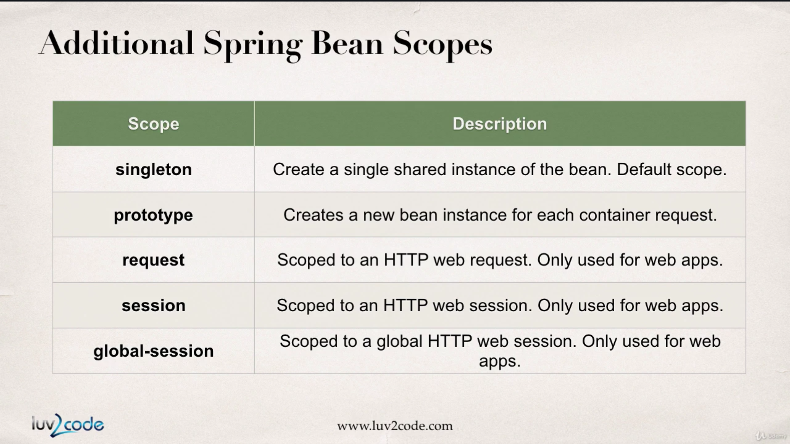
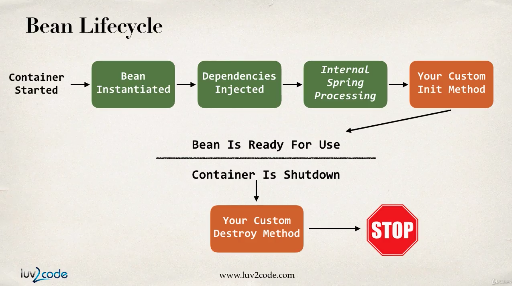
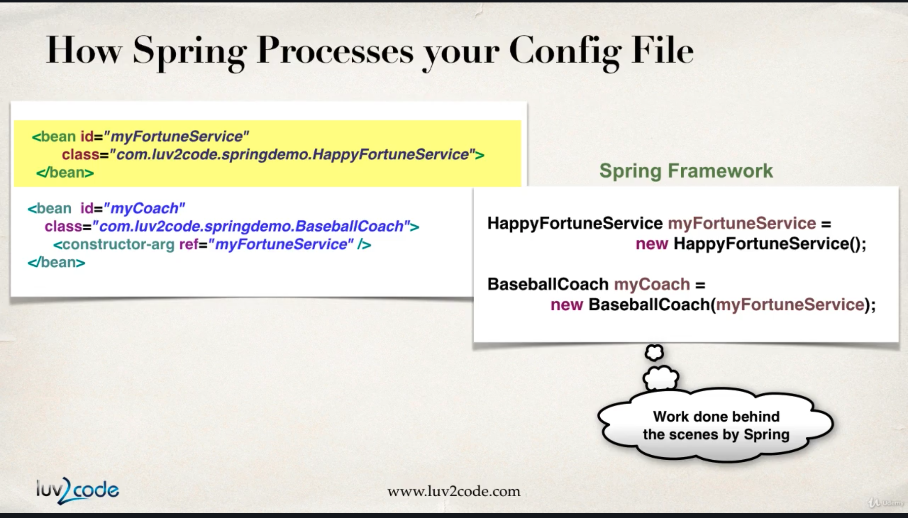
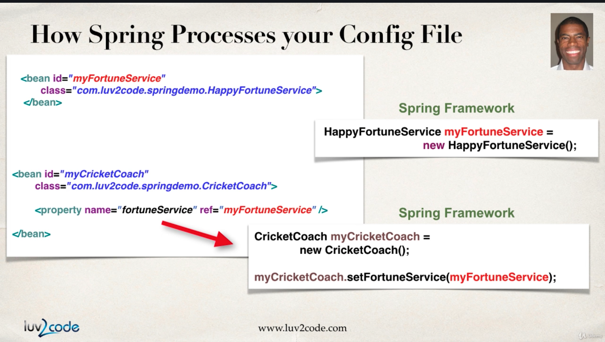
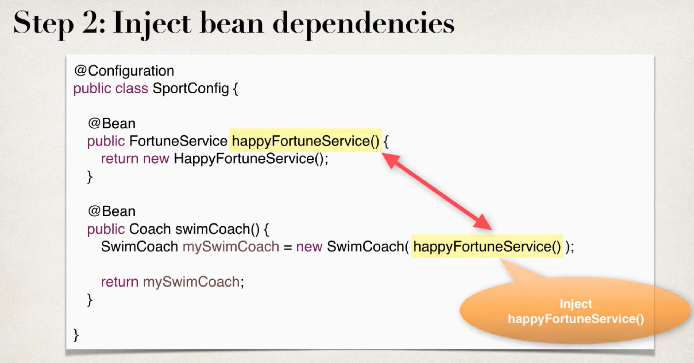

# Spring

### Full XML configuration file
```xml
<?xml version="1.0" encoding="UTF-8"?>
<beans xmlns="http://www.springframework.org/schema/beans"
       xmlns:xsi="http://www.w3.org/2001/XMLSchema-instance"
       xmlns:context="http://www.springframework.org/schema/context"
       xsi:schemaLocation="http://www.springframework.org/schema/beans
        http://www.springframework.org/schema/beans/spring-beans.xsd
        http://www.springframework.org/schema/context
        http://www.springframework.org/schema/context/spring-context.xsd">

    <context:property-placeholder location="sport.properties"/>

    <bean id="myFortuneService"
          class="md.Sergiu.Spring.RandomFortuneService">
    </bean>

    <bean id="myCoach"
          class="md.Sergiu.Spring.CricketCoach">
        <property name="fortuneService" ref="myFortuneService"/>
        <property name="emailAddress" value="${email}"/>
        <property name="team" value="${team}"/>
    </bean>

    <bean id="myTrackCoach"
          class="md.Sergiu.Spring.TrackCoach"
          scope="prototype"
          init-method="doMyStartupStuff"
          destroy-method="doMyCleanupStuff">
        <property name="fortuneService" ref="myFortuneService"/>
    </bean>
</beans>
```

### XML config and Annotation
```xml
<?xml version="1.0" encoding="UTF-8"?>
<beans xmlns="http://www.springframework.org/schema/beans"
       xmlns:xsi="http://www.w3.org/2001/XMLSchema-instance"
       xmlns:context="http://www.springframework.org/schema/context"
       xsi:schemaLocation="http://www.springframework.org/schema/beans
        http://www.springframework.org/schema/beans/spring-beans.xsd
        http://www.springframework.org/schema/context
        http://www.springframework.org/schema/context/spring-context.xsd">

    <context:property-placeholder location="sport.properties"/>
    <context:component-scan base-package="md.Sergiu.Spring"/>
</beans>
```

```java
    public static void main(String[] args) {
        // Load the spring configuration file
        ClassPathXmlApplicationContext applicationContext =
                new ClassPathXmlApplicationContext("applicationContext.xml");
        // retrieve bean from spring container
        Coach coach = applicationContext.getBean("myTrackCoach", Coach.class);
        Coach coach1 = applicationContext.getBean("baseballCoach", Coach.class);
        Coach coach11 = applicationContext.getBean("baseballCoach", Coach.class);
        CricketCoach coach2 = applicationContext.getBean("cricketCoach", CricketCoach.class);
```

### Pure Java config

```java
@Configuration
@ComponentScan("md.Sergiu.Spring")
@PropertySource("classpath:sport.properties")
public class SportConfig {

    @Bean
    public FortuneService randomFortuneService() {
        return new RandomFortuneService();
    }

    @Bean
    public Coach cricketCoach() {
        return new CricketCoach(randomFortuneService());
    }
}
```
Spring Bean
-
What is a Spring Bean?

*** A "Spring Bean" is simply a Java object.***

- When Java objects are created by the Spring Container, then Spring refers to them as "Spring Beans".

- Spring Beans are created from normal Java classes .... just like Java objects.

> In Spring, the objects that form the backbone of your application and that are managed by the Spring IoC container are called beans. A bean is an object that is instantiated, assembled, and managed by a Spring IoC container. Otherwise, a bean is simply one of many objects in your application. Beans, and the dependencies among them, are reflected in the configuration metadata used by a container.

In the early days, there was a term called "Java Beans". Spring Beans have a similar concept but Spring Beans do not follow all of the rigorous requirements of Java Beans.

***In summary, whenever you see "Spring Bean", just think Java object.***

* Spring Container creates only one instance of the bean, by default, it is cached in memory and all request for the bean will return a SHARED reference to the SAME bean (***Singleton***)

	

	
### Bean Lifecycle



#### Bean Lifecycle Methods/Hooks
* You can add custom code during ***bean initialization***
	* Calling custom business logic methods
	* Setting up handels to resources (db, sockets, file etc)

```xml
<bean id="myFortuneService"
	class="md.Sergiu.Spring.RandomFortuneService"
	init-method="doMyStartupStuff">
</bean>		
```

* You can add custom code during ***bean destruction***
	* Calling custom business logic methods
	* Clean up handels to resources (db, sockets, file etc)
	* For "***prototype***" scoped beans, Spring does not call the destroy method.
	* You can destroy "***prototype***" beans but custom coding is required.

```xml
<bean id="myFortuneService"
	class="md.Sergiu.Spring.RandomFortuneService"
	destroy-method="doMyCleanupStuff">
</bean>		
```


##### More about Defining init and destroy methods - Method Signatures

* ***Access modifier***
The method can have any access modifier (public, protected, private)

* ***Return type***
The method can have any return type. However, "void' is most commonly used. If you give a return type just note that you will not be able to capture the return value. As a result, "void" is commonly used.

* ***Method name***
The method can have any method name.

* ***Arguments***
The method can not accept any arguments. The method should be no-arg.

Inversion of Control (IoC)
-
***Create and manage objects***

This is common characteristic of frameworks, IoC manages java objects

- from instantiation to destruction through its BeanFactory.
- Java components that are instantiated by the IoC container are called beans, and the IoC container manages a bean's scope, lifecycle events, and any AOP features for which it has been configured and coded.

> QUICK EXAMPLE:Inversion of Control is about getting freedom, more flexibility, and less dependency. When you are using a desktop computer, you are slaved (or say, controlled). You have to sit before a screen and look at it. Using keyboard to type and using mouse to navigate. And a bad written software can slave you even more. If you replaced your desktop with a laptop, then you somewhat inverted control. You can easily take it and move around. So now you can control where you are with your computer, instead of computer controlling it.

By implementing Inversion of Control, a software/object consumer get more controls/options over the software/objects, instead of being controlled or having less options.

Dependency Injection
-
***Inject object's dependencies***

Dependency Injection is a fundamental aspect of the Spring framework, through which the Spring container "injects" objects into other objects or "dependencies".

Simply put, this allows for loose coupling of components and moves the responsibility of managing components onto the container

* There are many types of injection with spring
* The two most common:
	* Constructor Injection
	
	* Setter Injection
	
	

	
	
Injecting Values from a Properties File
-

Make a file.properties with all variable and values for it:

	email = sergiu.babin@stud.acs.upb.ro
	team = winner
And in configuration file (applicationContext.xml) you need to add 
#### XML Code
```xml
<context:property-placeholder location="sport.properties"/>
```
#### Java annotations
```java
@PropertySource("classpath:sport.properties")
```
After that you can use your value:
#### XML Code
```xml
<property name="emailAddress" value="${email}"/>
<property name="team" value="${team}"/>
```
#### Java annotations

```java
@Value("${email}")
private String email;
    
@Value("${team}")
private String team;
```

Annotations
-
* ***Java Annotations*** is special labels/markers added to Java classes
	* Provide meta-data about the class
	* Processed at compile time or run-time for special processing

#### Why Spring Configuration with Annotation ?
* XML configuration can be verbose
* Configure your Spring beans with Annotations
* Annotations minimizes the XML configuration

If you wanna use Annotations you need to enable component scanning in Spring config file

```xml
<context:component-scan base-package="md.Sergiu.Spring"/>
```
It will be recursively scanning packege.


@Override -> Tell compiler we are overriding a method. At compilation time, compiler will check/verify the override.


***@Components*** -> We can use @Component across the application to mark the beans as Spring's managed components.

* **@Components("nameOfBean")** -> specify name of bean
* ***@Components*** -> default is class name with first lowercase letter
		
		HappyFortuneService --> happyFortuneService
		RESTFortuneService --> RESTFortuneService

***@Autowired*** -> We use it for Constructor/Setter/Field Injection, choose a stayle and stay consistent in you project.

* How work ? -> Spring will look for a class that matches the property.
	* matches by type: class or interface
	* if we have multiple implementation for bean type that we need, which one we use ? => ***@Qualifier("nameOfBeanThatWeUse")***

* Spring wiil inject it automatically .. hence it is autowired

***@Qualifier("nameOfBeanThatWeUse")*** ->if we have multiple implementation for bean type we can use this.

* It can be apply to Constructor/Setter/Field Injection

```java
	@Qualifier("randomFortuneService")
	@Autowired
	FortuneService fortuneService;
//----------------------------
	@Autowired
	public TrackCoach(@Qualifier("randomFortuneService") FortuneService fortuneService) {
		this.fortuneService = fortuneService;
	}
//-----------------------------
    @Autowired
    public void setFortuneService(@Qualifier("randomFortuneService") FortuneService fortuneService) {
        this.fortuneService = fortuneService;
    }
```

***@Value("${email}")*** -> Take value from properties file.

***@Scope("Prototype")*** -> Use to specify scope of bean (Singleton/Prototype....)

***@PostConstruct*** -> For init_method

***@PreDestroy*** -> For destroy_method

***@Configuration*** -> Used for Java configuration file

***@ComponentScan("packegeToBeScan")***(optional) -> Used for Java configuration file to specify Scan packege

***@Bean*** -> You can use @Bean to make an existing third-party class available to your Spring framework application context.
